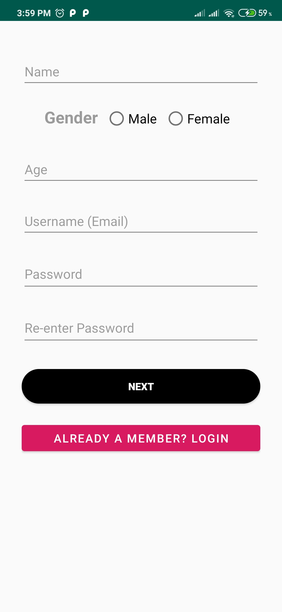
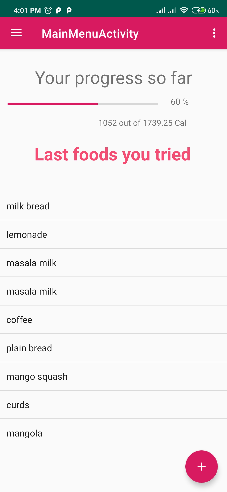
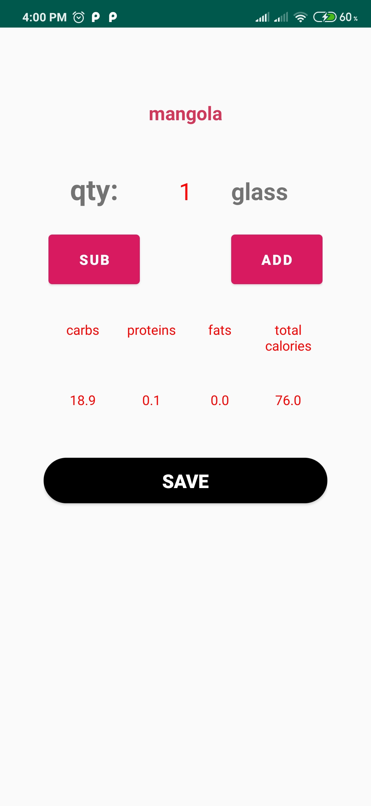

# EatFit
-----------
### EatFit is an android application which will track user’s calorie consumption on daily basis. 
User will set a fitness goal. On the basis of that, calorie goal will be given to user daily. 
Food will be suggested to user as per user input.
-----------
### Screenshots
-----------

-----------------------------------------------------

